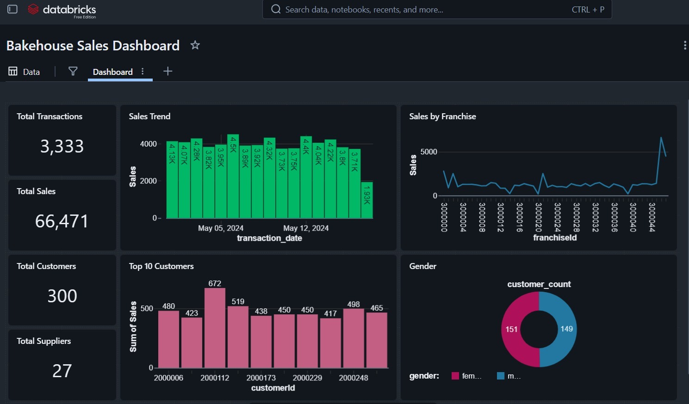

# BakeHouse Databricks Dashboard

## 📌 Overview

The **BakeHouse Databricks Dashboard** is a sales analytics project
developed using **Databricks** and **Spark SQL** with the BakeHouse
sample dataset.

This dashboard provides insights into customer behavior, transaction
patterns, and overall business performance through KPI monitoring and
interactive visualizations.

------------------------------------------------------------------------

## 🖼 Dashboard Preview

------------------------------------------------------------------------

## 🚀 Technologies Used

-   Databricks
-   Spark SQL
-   Data Visualization

------------------------------------------------------------------------

## 📊 Key Features

### ✅ Sales KPI Monitoring

Track key sales metrics and overall business performance.

### ✅ Daily Sales Trend Analysis

Analyze sales patterns and trends over time.

### ✅ Customer Demographics Analysis

Understand customer segments and purchasing behavior.

### ✅ Franchise Performance Tracking

Compare and evaluate performance across franchises.

### ✅ Weekday vs Weekend Sales Analysis

Identify differences in customer activity and sales volume.

------------------------------------------------------------------------

## 📈 Insights Generated

-   Sales performance trends
-   Customer purchasing behavior
-   Franchise comparison metrics
-   Peak business periods
-   Weekday and weekend sales distribution

------------------------------------------------------------------------

## 📂 Dataset

BakeHouse Sample Dataset

------------------------------------------------------------------------

## 👨‍💻 Author

Dedunu Ganhewa
